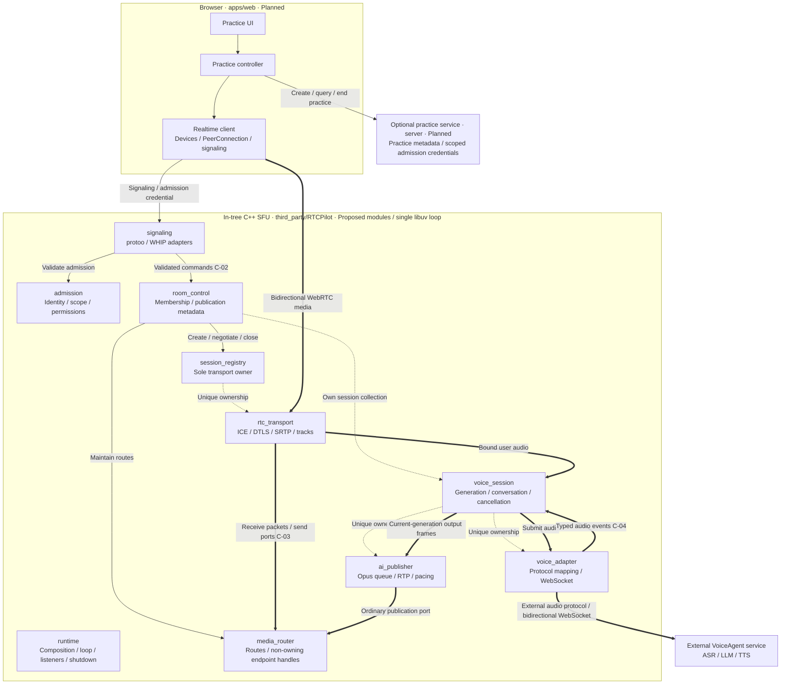

# CaptionMeet architecture

English | [中文](caption-meet-architecture.zh.md)

- Type: Architecture
- Status: Proposed
- Updated: 2026-09-26
- Authority: proposed module boundaries, dependency rules, contracts and resource ownership; not implementation approval
- Related: [PRD](../product-requirements.md), [gates](../reference/architecture-gates.md), [ADR 0001](../decisions/0001-vendor-rtcpilot-in-tree.md), [governance](../guides/architecture-governance.md)

> **Scope transition (2026-09-26):** The maintainer confirmed three-person LAN audio/video meetings with live captions; see the [current PRD](../product-requirements.md). The coaching workflow, one-human constraint and mandatory AI reply path below are superseded product assumptions, not meeting implementation instructions. Existing ownership, cancellation, security and compatibility constraints remain relevant; module APIs and contracts are still Proposed/Outline. WI-002 gathers build/media evidence before adapting the design. The external VoiceAgent policy is unchanged.

## Task reading guide

This is the single task-to-section routing index; AGENTS and the documentation index link here rather than duplicate it. Keep existing section numbers stable. Read the selected sections using headings/search and bounded file reads; a link does not require loading the whole document.

For architecture-impacting work, first read §1 (status/scope; the overview diagram is optional), §3 (identities) and §6 (dependency invariants). Then select routes below, cumulatively when tasks overlap. Pure copy/translation changes need the affected passage and bilingual policy, not every architecture route.

- **Browser practice flow:** §4.1–4.3, C-01/C-02/C-06, browser ownership in §8 and relevant states/cleanup in §9. For user-visible work also read the PRD; do not infer acceptance from this proposal.
- **Business service / admission:** §4.4, §5.3–5.4, C-01/C-02/C-06, §8–10; consult `gate-session-admission` before non-local deployment.
- **Session cleanup / reconnect / shutdown:** §5.1, §5.5–5.6, C-02/C-05/C-06, §8–9; use §11 lifecycle tests and `gate-sfu-lifecycle`.
- **RTP / RTCP / forwarding / buffer ownership:** §5.6–5.7, C-03/C-05, §8–10, media acceptance in §11; consult `gate-media-capacity`.
- **VoiceAgent / AI queue / interruption:** §5.8–5.10, C-03–C-06, §8–10 and voice tests in §11; also read the in-tree configuration guide's `voice_agent` section and affected bridge source. Consult `gate-voice-agent-bridge`.
- **Signaling / WHIP / room commands:** §5.2–5.5, C-02/C-05/C-06, §8–10 and WHIP regression acceptance in §11; consult signaling and admission gates.
- **Cluster / legacy streaming:** §5.11 plus the touched room, transport or routing modules; C-03/C-05/C-06 and §8–10. Follow actual caller/callee evidence; the single-node proposal is not cluster certification.
- **New public interface / module extraction:** affected §4/§5 modules, §6, matching C-01–C-06, §8–9, and §10 if trust, queues or persistence change. Read consumers and boundary tests, not just the new interface.
- **Build / dependency / upstream upgrade:** §2, §6, §11–12, [ADR 0001](../decisions/0001-vendor-rtcpilot-in-tree.md), relevant CMake/configuration and tests; consult build/boundary gates.

For architecture changes, scan the [governance dimension index](../guides/architecture-governance.md#index-dimensions-at-a-glance) and checklist headings before selecting detailed dimensions. Lifecycle work normally requires ownership, concurrency, errors, cleanup and tests; API work requires interfaces, dependencies, contracts and compatibility; security/persistence changes add the corresponding dimensions. Report applicable pass/gap/N/A with evidence. Do not edit the generated governance guide to duplicate product routes.

Expand reading when a contract references another invariant, ownership crosses modules, callbacks outlive a caller, or source disagrees with this Proposed design. Consult §2/§12 for evidence/gaps and the [gate register](../reference/architecture-gates.md) for affected gates. Stop when affected producers, consumers, owners, failure paths and tests are covered. These routes never waive kernel/collaboration requirements or turn Outline contracts into Living ones.

## 1. Decision and scope

Use a **modular C++ SFU monolith**, a browser client, an optional thin business service, and an external VoiceAgent service. Keep RTCPilot development in `third_party/RTCPilot`; do not restore a sibling-checkout requirement. Retain upstream licenses and provenance. The target architecture overview below supplements, but does not replace, the contracts and ownership rules in the text.

Internal module boundaries are compile-time and ownership boundaries, not new network services. Start with the existing single libuv event loop. Do not introduce a generic event bus, service locator, microservice fleet, shared mutable session store, or a second ASR/LLM/TTS implementation.

The browser/server language and framework are **not selected** by this proposal. Node documentation scripts do not select the product stack. TypeScript guidance applies only if TypeScript is later adopted. C++17 is the current SFU build baseline.

**Maturity:** design direction with **Outline** contracts. None of the proposed module APIs are Living or implemented merely because they appear here. The PRD remains Draft. ADR 0001 accepts only the in-tree sourcing decision, not this redesign, production security, or functional readiness.

### 1.1 Target architecture overview (Proposed)

Modules correspond to sections 4–5: these are target boundaries, not completed source extraction. Solid edges denote narrow interface calls/control, thick edges media data, and dashed edges lifetime ownership. Arrows do not authorize reverse implementation includes. Return values, text events and callbacks are omitted for clarity.

- **Media bypasses the business service.** Browser audio passes through the SFU; AI audio enters normal routing through the AI publisher and returns through RTC transport. Thick edges show the main path with single arrows; connections labeled bidirectional include return traffic, and the router sends back through transport send ports.
- **Admission is not shared memory.** The optional service issues a credential, the browser carries it, and the SFU verifies it. No service-to-room-map mutation authority is implied.
- **Composition is not a business call.** Runtime constructs and owns top-level modules and injects ports; its wiring edges are omitted to avoid clutter. Dashed edges highlight nested ownership only. Complete ownership is in section 8; cancellation/shutdown in C-05 and section 9.
- **No hidden stack decision.** Cluster and legacy adapters are collapsed out of this overview but remain governed by section 5.11. Web/server technology remains undecided. New APIs and security capabilities remain Proposed / Outline.

## 2. Evidence and current gaps

The following paths are relative to `third_party/RTCPilot/`:

- `src/RTCPilot.cpp`: composition root using `uv_default_loop()`, network listeners and optional cluster/legacy streaming services. No complete ordered application drain is established in this main path.
- `src/ws_message/ws_message_session.cpp` and `src/webrtc_room/room_mgr.cpp`: JSON/protoo dispatch, including `join`, `push`, `pull`, `heartbeat`, and `textMessage`.
- `src/webrtc_room/room.hpp` / `room.cpp`: `Room` combines membership, SDP, packet routing, cluster callbacks, voice text and AI RTP publication. This is the principal decomposition seam.
- `src/webrtc_room/webrtc_server.cpp`: static username/address registries hold sessions. Cleanup traversing only address entries does not cover sessions awaiting their first STUN packet.
- `src/webrtc_room/webrtc_session.*`, `media_pusher.cpp`, `media_puller.hpp`: transport/security and track resources have overlapping shared ownership and borrowed callback pointers.
- `src/webrtc_room/voice_agent/voice_agent.cpp`: external JSON/WebSocket adapter; an audio pusher creates a bridge. AI output is currently coordinated by room-wide state. Conversation IDs are narrowed to integers, which is not a safe general identifier contract.
- `src/net/udp/udp_pub.hpp`, `src/utils/timer.cpp`, `src/webrtc_room/pilot_message_client.*`: pending I/O, timer and request callbacks need explicit cancellation/lifetime guarantees.
- `CMakeLists.txt`: one broad executable source list and broad include visibility, not enforced module targets. `tests/` contains TCC, timer and protoo tests, not comprehensive lifecycle/bridge tests; executable targets are not proof of CTest registration.

These are source-inspection findings, not reproduced runtime failures. `apps/web` and `server` remain placeholders. Documentation checks do not demonstrate that the SFU builds or interoperates with VoiceAgent.

## 3. Domain identities and invariants

- `PracticeSessionId`: product practice attempt; owned by the business service if deployed. It is not a WebRTC transport ID.
- `RoomId`: SFU membership and routing scope. `ParticipantId`: admitted identity within that scope; never trust a browser-provided ID as authorization.
- `TransportId`: one negotiated WebRTC transport. `PublicationId`: one published media track. `SubscriptionId`: one receiver's subscription. Transport SSRCs are not durable publication identities.
- `Generation`: monotonically increasing local incarnation of a participant connection. Reconnect creates a new generation; old callbacks cannot mutate the replacement.
- `ConversationId`: opaque upstream string, never `atoi()`-converted. `TurnId` and `EventSequence` are local correlation fields and must not be represented as upstream guarantees.

All cross-session handles carry scope and generation. A lookup failure or stale generation is a normal rejected operation, not permission to recreate a room. A publication belongs to exactly one participant; a subscription belongs to exactly one receiver; neither owns its transport.

**Superseded coaching assumption:** one human and one AI conversation per room was the earlier product proposal. The confirmed meeting scope now requires a hard maximum of three human participants and independent captions, with no AI spoken replies. This does not prove that the current bridge already supports recognition-only meetings; that integration remains to be verified.

## 4. Product-side modules (Planned)

### 4.1 Practice UI — `apps/web`, presentation

Owns rendering, user intent and transient view state. Calls only the practice controller. Must not parse protoo messages, retain provider secrets, administer SFU rooms, or treat displayed transcripts as durable truth.

### 4.2 Practice controller — `apps/web`, application

Owns one local practice lifecycle and its event subscriptions. Public operations: `startPractice(themeId)`, `setMicrophoneEnabled(enabled)`, `endPractice()`, `observePractice(listener)`. Observation returns a disposable subscription; it is not a general event bus.

Depends on a small business-client port and a realtime-client port. Does not own DOM nodes or WebRTC objects. State distinguishes idle, starting, active, reconnecting, ending, ended and failed. Calling start while active fails with `InvalidState`; end is idempotent. Failed start compensates every acquired resource.

### 4.3 Realtime client — `apps/web`, browser adapter

Owns `MediaStream`, microphone tracks, `RTCPeerConnection`, signaling socket, playback binding and reconnect timers. Operations: `connect(joinDescriptor)`, `publishMicrophone()`, `setMuted(enabled)`, `disconnect()`, plus typed connection/media/text events.

Only this module understands browser WebRTC and the RTCPilot wire format. It translates protocol DTOs into application events. Disconnect stops tracks, removes listeners, closes peer/socket resources and releases playback. It cannot mint membership permissions.

### 4.4 Practice service — `server`, optional trusted control plane

Owns practice metadata, theme selection and issuance of restricted join descriptors. Public use cases: `createPractice(themeId, requestId)`, `getPractice(practiceSessionId)`, `endPractice(practiceSessionId, requestId)`. Identity comes from authenticated context, not a request body assertion.

A join descriptor contains the signaling endpoint, room/participant scope, expiry and a scoped admission credential. It contains no VoiceAgent/provider credential or arbitrary upstream URL supplied by the browser. Credentials require an SFU verifier before this is safe; this capability does not exist merely because the service issues a token.

Service dependencies are narrow ports for theme lookup, admission issuance and optional practice storage. No database is required for the initial local spike. Persistent history, recordings and assessment engines are deferred. Without the service, only an explicitly local development mode using trusted fixed configuration is allowed; do not market it as an authenticated deployment.

## 5. SFU module boundaries (Proposed)

All proposed SFU modules stay under `third_party/RTCPilot`. Names below are logical modules and future target names, not claims that directories already exist. Extract from current files incrementally, preserving the executable entry point.

### 5.1 Runtime composition — `runtime`

Owns the event loop, validated immutable configuration, listeners, module instances and shutdown coordinator. Constructs concrete adapters and injects dependencies. Public lifecycle: `start(config)` and `stop(deadline)`.

Only this module knows all concrete implementations. It has no room policy, SDP manipulation or per-packet routing logic. Separate read-only configuration slices go to consumers; do not inject the global configuration singleton everywhere.

### 5.2 Signaling ingress — `signaling`

Owns WebSocket/HTTP protocol parsing, connection correlation, response serialization and ingress size/rate limits. Calls room-control commands after admission validation; receives typed results/events through a connection-scoped sink.

Protoo and WHIP are separate adapters over the same use cases. They do not write room maps or own media sessions. A WHIP resource identifies one publication; deleting it cannot delete unrelated participants or the whole room.

### 5.3 Admission — `admission`

Implements `authorizeJoin(credential, requestedScope, now)` and returns an immutable `AdmissionGrant` or an error. The grant specifies participant, room, publish/subscribe permissions and expiry. Other commands validate the connection's bound grant and generation.

Owns verification key material and replay/expiry policy; not room resources or product accounts. Verification fails closed outside explicit local development mode. This is a security gate, not a currently verified RTCPilot feature.

### 5.4 Room control — `room_control`

Owns membership, publication/subscription metadata and room state. Public operations: `join`, `publish`, `subscribe`, `leave`, `heartbeat`, `snapshot`. Each accepts a typed command and validated context, not arbitrary JSON/method strings.

Orchestrates session, routing and voice ports. Owns logical room handles, not sockets, RTP packet queues, SDP parser internals or VoiceAgent WebSocket clients. It handles typed completion events; callbacks do not include mutable `Room*` references.

### 5.5 Session registry — `session_registry`

Is the **sole lifetime owner** of WebRTC sessions, indexed by opaque handles. Operations: `createTransport`, `negotiate`, `findTransport`, `closeTransport`, `closeParticipant`, `closeRoom`.

Username/address tables are non-owning indexes into the primary transport registry, not independent `shared_ptr` owners. Registration begins before STUN, with an explicit negotiation deadline. Closing a transport removes every index and blocks new operations before draining pending work.

Room control owns intent; the registry owns actual transport lifetime. `closeRoom` does not erase the room: it returns a completion after its transports drain, and room control then removes membership.

### 5.6 RTC transport — `rtc_transport`

Owns ICE/DTLS/SRTP, negotiated SDP state, receive/send track engines and network request scopes for one session. Implements negotiation, protected send and close; emits transport-ready/failed/closed and validated media callbacks.

Does not know product prompts, room membership storage, cluster routing or VoiceAgent JSON. Share the UDP listener at runtime level; a transport owns its registrations and pending operations, not the listener itself.

### 5.7 Media routing — `media_router`

Owns publication-to-subscriber route metadata, not sessions. Operations: `attachPublication`, `attachSubscription`, `detachPublication`, `detachSubscription`, `forwardPacket`.

Depends on narrow packet-source/sink ports. Existing `MediaPusher` receive and `MediaPuller` send engines remain transport-owned; routing holds non-owning generation-checked endpoint handles. Route mutation is serialized on the media loop. Room control removes routes before destroying transport endpoints.

No JSON, persistence, business queries or AI network requests in the packet-forwarding path. RTCP feedback is routed through transport capabilities, not arbitrary access to another session's internals.

### 5.8 Voice session — `voice_session`

Owns one coaching conversation's generation, cancellation scope, text sequence and output lifecycle. Operations: `start(binding)`, `submitAudio(frame)`, `stop(reason)`. Its binding includes room, participant, source publication and generation.

Owns a VoiceAgent adapter and an AI publisher instance. Receives immutable typed bridge events, applies stale-event/correlation rules, and directs audio publication. Must not own product records or implement ASR/LLM/TTS. One participant disconnect cancels only its bound voice session.

### 5.9 VoiceAgent adapter — `voice_adapter`

Owns the external WebSocket, codec/protocol conversion, jitter-buffer resources, heartbeat and bounded reconnect attempts. Interface is `connect(binding)`, `sendAudio(frame)`, `close()` and a typed event sink for recognized text, reply text, turn start/end, audio and failure.

Maps actual `input_audio_buffer.append`, `input.transcript`, `response.text`, `conversation.start`, `conversation.end`, `tts_opus_data` messages. It must not fabricate provider acknowledgements, transcript finality, turn cancellation support or replay guarantees that the upstream protocol does not supply.

No virtual room user or room map mutation here. Protocol upgrades should change this adapter and its fixture tests, not the UI and packet router together.

### 5.10 AI publisher — `ai_publisher`

Owns the virtual publication, Opus-frame queue, RTP packetization, SSRC/sequence/timestamp state and pacing timer for one voice session. Operations: `openPublication`, `enqueueAudio`, `discardTurn`, `close`.

Uses the ordinary media-router publication port. Gets unique stream identifiers from the SFU allocator; do not hard-code one shared SSRC for all conversations. Validates negotiated codec/clock/channels/frame duration before publication. It does not parse provider messages or choose conversation policy.

### 5.11 Optional adapters — cluster and legacy streaming

Cluster discovery/control depends on cancellable room-control ports; relay transport implements packet source/sink ports. Neither can bypass admission or directly change private room maps. Cluster clients own pending request records; room scopes own cancellation handles.

RTMP/HTTP-FLV/WebSocket-FLV remain optional edge adapters outside the initial coaching path. Preserve existing capabilities during extraction; do not redesign or remove them incidentally. Inter-node encryption and authorization are unverified; single-node acceptance does not certify cluster deployment.

## 6. Dependency rules and enforcement

1. UI depends on practice-controller public interfaces; controller depends on business/realtime ports; concrete browser/network adapters implement those ports. The composition root wires them.
2. Signaling depends on admission and room-control public contracts. Room control depends on session/routing/voice **ports**, not concrete WebSocket, HTTP or provider implementations.
3. Registry depends on RTC transport. Transport depends on RTP/RTCP, SDP, crypto and network primitives, never room control. Router depends on media value types and endpoint ports, never concrete `WebRtcSession` ownership.
4. Voice session depends on adapter and publisher ports. Adapter depends on external protocol/network primitives. Publisher depends on media publication and clock/scheduler ports. They must not import each other's implementation headers.
5. Reverse runtime notifications use injected typed sinks defined at the consumer boundary. Callback flow is not permission for reverse implementation includes or circular ownership.
6. Define a DTO once beside its owning public contract. Cross-language wire schemas are language-neutral and versioned; do not create a large `shared` package just to exchange a few fields. Private parser/library types (`json`, `uv_*`, mutable SDP objects) stay behind adapters.
7. Proposed CMake targets expose only explicit public include directories and declared link dependencies. No recursive global include list for new modules. Add compile-only consumer tests and forbidden-include checks; until these exist, boundary enforcement is a gap.
8. Do not add generic `invoke(method, payload)`, mutable-map getters, global service lookup or interfaces exposing every implementation method. Public API growth requires a named consumer, contract update and test.

## 7. Contract catalog (all Outline)

The following IDs are stable review anchors in this file. They become Living only with corresponding implementation, boundary tests and confirmed scope. Operation names are semantic proposals, not published C++ ABI or HTTP endpoints.

### C-01 Practice lifecycle

Owner: practice service for product state; controller owns only its local projection. Creation validates theme and caller, returns practice ID and restricted join descriptor. Repeating the same caller/request ID and payload returns the original result within a documented retry window; different payload returns `Conflict`. Ending an already-ended practice succeeds.

A service timeout has an **unknown outcome**, not guaranteed rollback. Query by request ID/session before retrying a create. Product-ended and SFU-drained are separate facts; remote teardown requires a future authenticated control adapter or bounded lease expiry, not direct shared-memory mutation.

### C-02 Room commands and snapshots

Owner: room control; signaling translates the wire. Common context: request ID, room ID, participant ID, generation, admission grant and deadline. Publish carries a bounded SDP offer; subscribe carries the target publication and receiver's offer. Results contain only operation-specific IDs/answer and state, not internal pointers.

Join requires an open room and admitted scope. Publish/subscribe require active membership and permissions; subscribe also requires a live target publication. Success installs metadata only after required transport/routes are ready to own; partial failure compensates allocations. Repeated leave succeeds; heartbeat cannot resurrect closed membership. Dedupe mutating requests per identity/generation/request ID with bounded storage; do not assume the existing protocol already provides this.

An SDP answer means negotiation was accepted, **not** ICE/DTLS connectivity. Transport readiness is a separate event. No automatic retry of non-idempotent publish with a fresh request ID. Reconnect obtains a new generation and full snapshot; no guaranteed event replay. Snapshot and subsequent subscription must have a common sequence barrier to avoid a race between them.

### C-03 Media buffer transfer

Owner: allocator/producing transport until transfer. A synchronous packet callback borrows an immutable packet view valid only until return. A queue accepts unique ownership or an immutable ref-counted buffer; it never retains a borrowed pointer. Forwarding borrows the input; each asynchronous output explicitly retains or copies its buffer and releases on send completion/cancel.

Each queue specifies maximum bytes, packets and age. Queue overflow returns `Backpressure` or applies an explicit real-time drop policy with a metric; no silent unbounded accumulation. Codec-inappropriate packet dropping is forbidden. Media statistics track gaps; packet delivery is not exactly-once or lossless.

### C-04 Voice events and AI output

Owner: voice session; adapter owns only protocol translation. Local event envelope: room, participant, publication, generation, opaque conversation ID where supplied, local turn ID, local sequence, kind and monotonic receive time. Only correlate upstream fields actually present. If an event cannot be safely attributed, reject it and mark the bridge failed rather than assigning it to the current speaker by guesswork.

Ordering is per connection/generation; no total ordering between independent bridges and no replay guarantee. Reconnect cancels the old output generation and does not resend captured audio. Conversation end means upstream turn end, not that queued audio has finished playing; publisher drain is a separate local event. Transcript text lacking a finality flag is not promoted to a final record.

Current assumed Opus/48 kHz/20 ms behavior needs fixture and interoperability verification; unsupported parameters fail explicitly. Local `discardTurn` invalidates generation and clears local audio. It is **not** proof that upstream synthesis was cancelled. Actual barge-in/provider cancel remains behind the voice bridge gate.

### C-05 Cancellation and close

Owner: the resource's creating module. Every asynchronous command has a request scope, monotonic deadline and generation. Its completion occurs once on the owning loop: success, error or cancellation. Timeout stops waiting and cancels local scope; it cannot claim a remote side effect was undone.

Close is idempotent and enters closing before detaching ingress. It rejects new work, invalidates callbacks, cancels timers/requests, drains outstanding network completions, then acknowledges closed. Late completions release buffers without accessing destroyed owners. A raw pointer captured by a pending UDP send is not a valid cancellation strategy. Closing from a callback must defer destruction until that callback unwinds.

### C-06 Error and compatibility envelope

Boundary errors use a stable code, safe message, request correlation and retry classification. Proposed codes: `InvalidArgument`, `Unauthorized`, `Forbidden`, `NotFound`, `InvalidState`, `Conflict`, `StaleGeneration`, `DeadlineExceeded`, `Cancelled`, `Backpressure`, `UpstreamUnavailable`, `UnsupportedCodec`, `ProtocolMismatch`, `Internal`.

Never include secrets, full SDP, raw provider messages or audio in public errors. The adapter maps codes to legacy wire responses; do not rename existing protoo methods/events incidentally. Existing local events include `userLeave` and `userDisconnect`; documentation naming alone does not establish `userLeft` compatibility.

Product-owned network contracts carry a major version and reject incompatible majors. Adding internal types does not version the external VoiceAgent protocol. For every breaking wire change, pin peer versions, supply compatibility tests and record the rollout decision before deployment.

## 8. Ownership and lifetime rules

- Runtime owns listeners, loop, module instances and crypto/log infrastructure. Listeners are not owned by a room.
- Room control owns rooms, members and logical publication/subscription records. Other modules retain opaque handles, not owning room pointers.
- Session registry alone owns transports. Username/address lookups are indexes. A transport owns DTLS/SRTP, track engines and pending network scopes.
- Media router owns routes only. A route cannot extend transport lifetime or resurrect a closed endpoint.
- Voice-session collection is owned by room control; each voice session uniquely owns its adapter and AI publisher. AI publisher owns every queued output frame and pacing task.
- Each network adapter owns its pending request map. The initiating room/voice scope holds cancellable handles, not the request map itself.
- Each observer registration returns a disposal token owned by the subscriber. The publisher must not invoke a disposed observer.
- Browser realtime adapter owns device/network resources. Business service owns practice metadata. External VoiceAgent owns model/provider runtime state. No shared writer spans these domains.

Prefer `unique_ptr` for lifetime ownership. Use `shared_ptr` only for genuinely shared immutable buffers or documented completion state, not as a substitute for a lifetime design. Borrowed references require a shorter synchronous lifetime; asynchronous work uses generation-checked handles or weak cancellation state. Every raw pointer in a public seam must state borrow/transfer semantics.

## 9. Concurrency, state and shutdown

All room, session-index, route and voice-session mutations stay on their owning libuv loop. Do not block that loop with filesystem/database calls, model work, slow logging or waits. Future worker jobs receive immutable data and post completion with generation checks; workers cannot mutate room maps. Do not add a mutex and claim the subsystem became thread-safe.

Room states: open, draining, closed. Transport states: negotiating, connecting, connected, closing, closed (failure enters closing with a recorded reason). Voice states: starting, active, degraded, stopping, stopped. Stopped instances are not reused; replacement creates a new generation. Invalid transitions produce `InvalidState` or a documented idempotent no-op.

Normal participant leave: stop its ingress/admission context; invalidate generation; stop voice input/output and remove publication/subscription routes; cancel outstanding room-scoped requests; close its transports; drain callbacks; remove participant metadata. Close the room only when empty and no room-level work remains. Other participants remain unaffected.

Process shutdown order:

1. Stop accepting new signaling/HTTP work and mark rooms draining.
2. Stop voice ingress/retries, cancel cluster/control requests and detach route producers.
3. Clear owned AI queues and cancel pacing/room timers; close sessions and protocol clients.
4. Drain pending send/close callbacks while loop, crypto and logs remain alive. Enforce a bounded shutdown deadline and report forced termination.
5. Close remaining listeners and timer handles; verify no unexpected active handles, then close the loop.
6. Destroy crypto only after all transport users are gone; flush/join log workers last.

Crash cleanup cannot promise graceful acknowledgements. Without durable practice storage, a restart loses local session state; clients must begin a new generation, not assume a resumed conversation.

## 10. Security, capacity and privacy

TLS does not provide membership authorization. Validate credentials at SFU ingress and permissions on publish/subscribe; reject room/user impersonation. Rate-limit join, SDP and text requests; constrain payload sizes before parsing/allocation. Provider endpoints and key paths are trusted deployment configuration, not browser-controlled input.

VoiceAgent transport security is an open item: the inspected bridge creates a non-TLS connection. Restrict deployment to an explicitly trusted local/private boundary until TLS or a secured transport is verified. Cluster UDP confidentiality cannot be inferred from browser DTLS/SRTP.

No audio/transcript persistence by default. Transcript UI is an ephemeral projection. Future recording/history requires explicit retention, consent, deletion and access-control requirements plus a storage owner; do not introduce a database as an incidental architecture refactor.

Use bounded per-room/per-connection capacities: participants, pending requests, SDP/text bytes, voice input age and AI output duration. Proposed startup defaults for a spike: 10 s control deadline, 15 s negotiation deadline, at most 128 outstanding control requests per connection, 64 KiB SDP, 16 KiB text, 500 ms queued voice input, 2 s queued AI output. These are test hypotheses, not measured service guarantees; tune in the capacity gate. On voice queue overflow, fail/cancel the affected turn and surface degradation instead of playing increasingly stale speech.

Log lifecycle changes once at the owning boundary, with correlation and safe error codes. Measure active/pre-STUN sessions, pending callbacks, queue depth/age, dropped frames, turn latency and shutdown duration. Do not log provider tokens, raw SDP, audio or transcript bodies by default. Even identifiers require bounded retention; metrics are not permission to retain conversations.

## 11. Migration and executable acceptance

Keep the existing wire protocol and single-node behavior while extracting seams. Do not move the whole tree first. Each implementation slice requires its own confirmed proposal and relevant PRD assessment.

1. **Baseline:** reproduce a clean in-tree C++17 build and existing test executables; register reliable tests with CTest. Record dependencies and build platform. Use protocol fixtures to capture current behavior. No sibling paths or copied build artifacts.
2. **Lifecycle first:** introduce primary session ownership, scoped request cancellation, injectable clock and ordered shutdown behind existing entry points. Prove pre-STUN expiry, participant-scoped cleanup, room close with pending callbacks, and no post-close access.
3. **Control/media split:** isolate JSON/WHIP handling from room commands; move routing out of `Room`. Preserve negotiated media behavior with packet/SDP fixtures and a local WebRTC round trip. Verify deleting a WHIP publication does not remove another participant.
4. **Voice split:** extract adapter, voice session and AI publisher; test queue cleanup, opaque IDs, interleaved/stale events, disconnect during synthesis, overflow and codec mismatch using a local fake upstream. Real interoperability remains a separate acceptance step.
5. **Product integration:** after PRD confirmation, implement minimal browser/client ports and decide whether a trusted service is required. Prove admission enforcement before non-local deployment. No automatic TS/Node framework selection.

Test each boundary with fakes, not the entire stack: fake clock/scheduler, transport sink, admission verifier and VoiceAgent endpoint. Add ASan/UBSan lifecycle runs; use leak/handle counts and repeated open/close tests. TSan is relevant only for actual worker crossings and does not replace loop-affinity tests. Load tests must compare throughput, CPU, memory and tail latency against the same baseline before accepting performance claims.

## 12. Governance assessment and unresolved gates

- **Module decomposition — gap:** current `room.hpp` exposes signaling, cluster and voice concerns. Sections 4–5 define target seams, not extracted targets.
- **Interfaces/contracts — gap:** current callback headers lack the cancellation/correlation guarantees in C-02 through C-05. Contract tests are required before Living status.
- **Dependency enforcement — gap:** current `CMakeLists.txt` has broad includes. Section 6 requires narrow public headers and compile tests.
- **Ownership/concurrency — gap:** current static session maps and pending raw callbacks need the lifecycle migration in section 11. Do not claim memory safety from this document.
- **Source boundary — pass:** ADR 0001 and `third_party/RTCPilot/UPSTREAM.md` establish the intended in-tree source location; build reproducibility remains unverified.
- **Security/performance — gap:** admission, secure bridge transport and bounded queues require executable validation; section 10 is a target, not an audit certificate.
- **Persistence — N/A for this slice:** none introduced; a future history feature must reopen the data/retention decision.
- **UI delivery — N/A for this slice:** no browser behavior implemented; PRD stays Draft.

Track `gate-sfu-build`, `gate-sfu-boundaries`, `gate-sfu-lifecycle`, `gate-session-admission`, `gate-media-capacity`, plus existing signaling and voice bridge gates in the [gate register](../reference/architecture-gates.md). No new gate is closed by this documentation change. Conclusion: **document first, then focused spikes, then incremental implementation after maintainer approval**.
