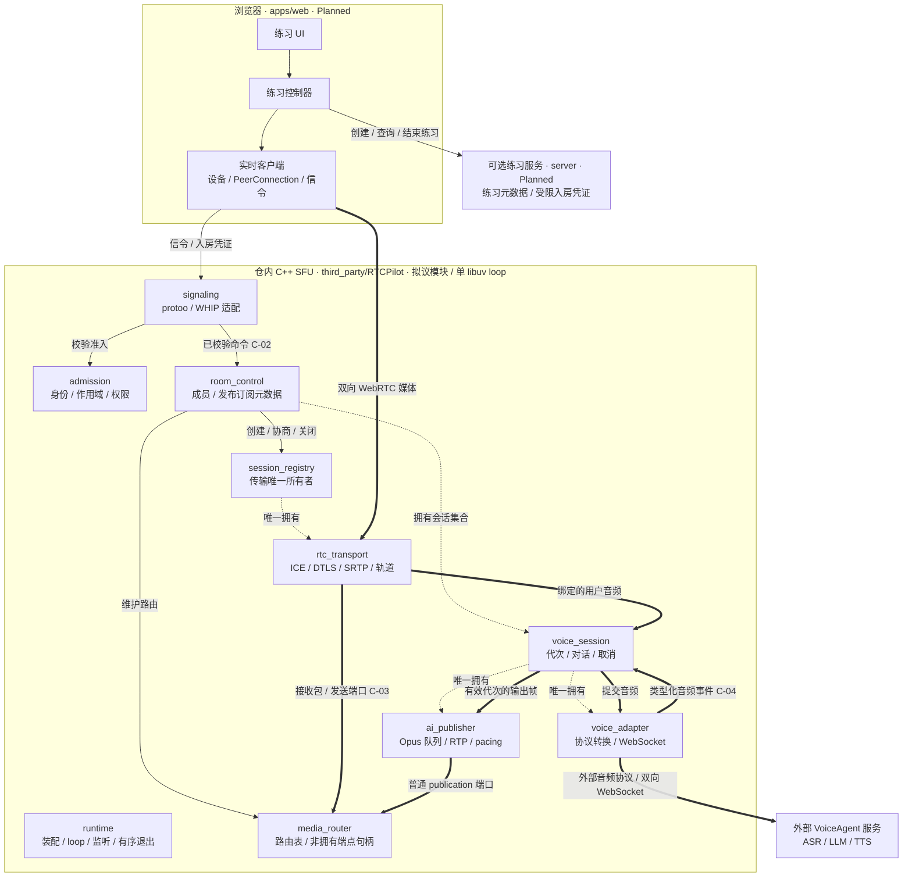

# CaptionMeet 架构

[English](caption-meet-architecture.md) | 中文

- 翻译状态：Machine Draft
- 权威原文：[caption-meet-architecture.md](caption-meet-architecture.md)
- 原文版本：Uncommitted baseline
- 最近同步：2026-09-26

- 类型：架构
- 状态：Proposed
- 更新：2026-09-26
- 权威：拟议模块边界、依赖规则、契约和资源所有权；不构成实现批准
- 相关：[PRD](../product-requirements.zh.md)、[gate](../reference/architecture-gates.zh.md)、[ADR 0001](../decisions/0001-vendor-rtcpilot-in-tree.zh.md)、[架构治理](../guides/architecture-governance.zh.md)

> **范围变更（2026-09-26）：** 维护者已确认带实时字幕的局域网三人音视频会议，见[当前 PRD](../product-requirements.zh.md)。下文陪练流程、单真人限制和必需的 AI 回复路径属于已被取代的产品假设，不是会议实现指令。所有权、取消、安全及兼容性约束仍应遵守；模块接口与契约仍为 Proposed/Outline。WI-002 先收集构建和媒体证据，再调整设计。外部 VoiceAgent 集成规则保持不变。

## 按任务阅读导航

这里是任务到章节的唯一路由索引，AGENTS 和文档索引引用此处，不重复维护。保留原有章节编号。用标题检索和限定范围读取所选章节，链接到一份文档不意味着必须全文加载。

涉及架构的任务先读 §1（状态/范围，总览图可选）、§3（标识）、§6（依赖不变量），再按下列任务选择，重叠任务取并集。纯文案/翻译修改读受影响段落和双语规则即可，不必加载全部架构路由。

- **浏览器练习流程：** §4.1–4.3、C-01/C-02/C-06、§8 的浏览器所有权、§9 相关状态/清理。用户可见工作还须读 PRD，不能从本提案推导已验收。
- **业务服务 / 准入：** §4.4、§5.3–5.4、C-01/C-02/C-06、§8–10；非本地部署前核对 `gate-session-admission`。
- **会话清理 / 重连 / 退出：** §5.1、§5.5–5.6、C-02/C-05/C-06、§8–9；读取 §11 生命周期验收与 `gate-sfu-lifecycle`。
- **RTP / RTCP / 转发 / 缓冲所有权：** §5.6–5.7、C-03/C-05、§8–10、§11 媒体验收；核对 `gate-media-capacity`。
- **VoiceAgent / AI 队列 / 打断：** §5.8–5.10、C-03–C-06、§8–10、§11 语音测试；补读仓内配置指南的 `voice_agent` 章节及受影响桥接源码，核对 `gate-voice-agent-bridge`。
- **信令 / WHIP / 房间命令：** §5.2–5.5、C-02/C-05/C-06、§8–10、§11 WHIP 回归验收；核对信令和准入 gate。
- **集群 / 传统流媒体：** §5.11 以及受影响的房间/传输/路由模块，C-03/C-05/C-06、§8–10。沿真实调用者/被调用者取证，单节点提案不是集群认证。
- **新公开接口 / 模块抽取：** 受影响的 §4/§5 模块、§6、对应 C-01–C-06、§8–9；涉及信任、队列、持久化时补 §10。读取消费者和边界测试，不只看新接口。
- **构建 / 依赖 / 上游升级：** §2、§6、§11–12、[ADR 0001](../decisions/0001-vendor-rtcpilot-in-tree.zh.md)、相关 CMake/配置/测试；核对构建和边界 gate。

架构变更先扫描[治理指南英文维度索引](../guides/architecture-governance.md#index-dimensions-at-a-glance)及检查项标题，再细读适用维度。生命周期任务通常涉及所有权、并发、错误、清理、测试；API 任务涉及接口、依赖、契约、兼容；安全/持久化变更增加对应维度。用证据报告适用项 pass/gap/N/A。不要修改生成的治理指南来重复产品路由。

契约引用其他不变量、所有权跨模块、回调长于调用者、源码与 Proposed 设计冲突时必须扩读。证据/缺口见 §2/§12，相关 gate 见 [gate 登记](../reference/architecture-gates.zh.md)。覆盖受影响生产者、消费者、所有者、失败路径和测试后停止扩读。路由不豁免内核/协作要求，也不把 Outline 契约变成 Living。

## 1. 结论与范围

采用 **模块化 C++ SFU 单体 + 浏览器客户端 + 可选薄业务服务 + 外部 VoiceAgent**。RTCPilot 在 `third_party/RTCPilot` 内持续开发，不恢复兄弟仓依赖；保留上游许可证与来源。目标架构总览见下图，具体契约与所有权以正文为准。

内部模块边界是编译与所有权边界，不意味着拆成网络服务。先保持现有单 libuv 事件循环。不引入通用事件总线、服务定位器、微服务群、共享可变会话仓库，也不重写 ASR/LLM/TTS。

本提案**不决定**浏览器和业务服务的语言、框架。Node 文档工具不代表产品选型；只有以后采用 TypeScript，相关指南才适用。现有 SFU 构建基线为 C++17。

**成熟度：** 架构方向与 **Outline** 契约。本文提出的模块 API 不因写入文档就成为 Living 或已经实现。PRD 保持 Draft。ADR 0001 只确认仓内维护策略，没有确认本次重设计、生产安全或功能可用性。

### 1.1 目标架构总览（Proposed）

图中模块名与第 4–5 节对应，表示目标边界，不表示源码已经完成拆分。实线表示窄接口调用/控制，粗线表示媒体数据，虚线表示生命周期拥有；箭头不表示反向 include。模块回传结果、文本事件和回调为简洁起见省略。

- **媒体不经过业务服务。** 浏览器音频经 SFU；AI 音频由 AI 发布器进入普通媒体路由，再经 RTC 传输返回浏览器。粗线用单箭头表达主要路径，标注“双向”的连接包含返回流量；router 通过发送端口回送 transport。
- **准入不是跨服务共享内存。** 可选服务签发凭证，浏览器携带，SFU 自行校验；图中不存在业务服务直接修改房间 map 的权限。
- **装配不是业务调用。** `runtime` 构造并拥有顶层模块，注入端口；为避免连线遮蔽，省略其装配连线。虚线只画关键嵌套所有权；完整资源归属见第 8 节，取消/退出见 C-05 与第 9 节。
- **没有隐藏选型。** 集群和传统流媒体适配器未展开，仍受第 5.11 节约束；Web/server 技术栈待定。所有新增 API 与安全能力仍是 Proposed / Outline。

## 2. 现状证据与缺口

以下路径相对于 `third_party/RTCPilot/`：

- `src/RTCPilot.cpp`：组合入口使用 `uv_default_loop()`，创建网络监听与可选集群/传统流媒体服务；主路径尚未建立完整、有序的退出排空流程。
- `src/ws_message/ws_message_session.cpp`、`src/webrtc_room/room_mgr.cpp`：JSON/protoo 分派，包含 `join`、`push`、`pull`、`heartbeat`、`textMessage`。
- `src/webrtc_room/room.hpp` / `room.cpp`：`Room` 同时处理成员、SDP、包路由、集群回调、语音文本和 AI RTP 发布，是首要拆分位置。
- `src/webrtc_room/webrtc_server.cpp`：静态 username/address 表持有会话；只遍历地址表的清理无法覆盖尚未收到首次 STUN 的会话。
- `src/webrtc_room/webrtc_session.*`、`media_pusher.cpp`、`media_puller.hpp`：传输、安全、轨道资源存在交叠的共享所有权及借用回调指针。
- `src/webrtc_room/voice_agent/voice_agent.cpp`：外部 JSON/WebSocket 适配器，由音频 pusher 创建；AI 输出目前由房间级状态协调。把 conversation ID 缩为整数不适合作为通用标识契约。
- `src/net/udp/udp_pub.hpp`、`src/utils/timer.cpp`、`src/webrtc_room/pilot_message_client.*`：未完成 I/O、定时器和请求回调需要明确的取消与生命周期保证。
- `CMakeLists.txt`：大可执行目标和宽泛头文件可见性，尚无强制模块边界。`tests/` 有 TCC、timer、protoo 测试，不代表具备完整生命周期/桥接测试，也不代表已注册 CTest。

这些是源码检查结论，不是已复现的运行故障。`apps/web`、`server` 仍为占位。文档检查不能证明 SFU 可编译或已与 VoiceAgent 互通。

## 3. 领域标识与不变量

- `PracticeSessionId`：一次产品练习；部署业务服务时由该服务管理，不等于 WebRTC 传输 ID。
- `RoomId`：SFU 成员与路由作用域。`ParticipantId`：该作用域内经准入的身份；浏览器自报 ID 不能视为授权。
- `TransportId`：一条协商后的 WebRTC 传输。`PublicationId`：一条发布轨道。`SubscriptionId`：一个接收者的订阅。SSRC 不作为持久发布标识。
- `Generation`：参与者连接的本地递增代次；重连产生新代次，旧回调不得修改替代实例。
- `ConversationId`：上游不透明字符串，禁止 `atoi()`。`TurnId`、`EventSequence` 是本地关联字段，不能假称上游提供了这些保证。

跨会话句柄携带作用域与代次。查找失败或代次过期应拒绝操作，不得自动重建房间。发布只属于一个参与者；订阅只属于一个接收者；两者均不拥有传输对象。

**已被取代的陪练假设：** 每房间一位真人与一条 AI 对话是先前产品提案。已确认会议范围改为最多三位真人、独立字幕、不提供 AI 语音回复。这不证明现有桥接已经支持纯识别会议，该集成能力仍需验证。

## 4. 产品侧模块（Planned）

### 4.1 练习 UI — `apps/web` 展示层

拥有渲染、用户意图和临时视图状态，只调用练习控制器。不解析 protoo，不保留供应商密钥，不管理 SFU 房间，不把显示的字幕当作持久事实。

### 4.2 练习控制器 — `apps/web` 应用层

拥有一次本地练习生命周期及事件订阅。公开操作：`startPractice(themeId)`、`setMicrophoneEnabled(enabled)`、`endPractice()`、`observePractice(listener)`。观察返回可释放订阅，不是通用事件总线。

依赖窄的业务客户端端口与实时客户端端口，不拥有 DOM 或 WebRTC 对象。状态区分 idle、starting、active、reconnecting、ending、ended、failed。active 时重复 start 返回 `InvalidState`；end 幂等。启动失败须补偿释放已获得的资源。

### 4.3 实时客户端 — `apps/web` 浏览器适配层

拥有 `MediaStream`、麦克风轨道、`RTCPeerConnection`、信令 socket、播放绑定、重连定时器。操作：`connect(joinDescriptor)`、`publishMicrophone()`、`setMuted(enabled)`、`disconnect()`，并发出类型化连接/媒体/文本事件。

只有本模块理解浏览器 WebRTC 和 RTCPilot 线协议，把协议 DTO 转成应用事件。断开时停止轨道、移除监听、关闭 peer/socket、释放播放绑定；不能签发成员权限。

### 4.4 练习服务 — `server` 可选可信控制面

拥有练习元数据、主题选择与受限入房描述的签发。公开用例：`createPractice(themeId, requestId)`、`getPractice(practiceSessionId)`、`endPractice(practiceSessionId, requestId)`。调用身份来自认证上下文，不信任请求正文的自报身份。

入房描述包含信令地址、房间/参与者作用域、有效期和限定权限的准入凭证；不含 VoiceAgent/供应商密钥，也不接受浏览器指定任意上游地址。**必须同时有 SFU 校验器**；服务能签 token 不等于链路安全。

服务只依赖主题查询、准入签发与可选练习存储端口。初始本地 spike 不要求数据库。历史、录音、评估引擎延后。没有业务服务时，只允许使用可信固定配置的明确本地开发模式，不称其为已认证部署。

## 5. SFU 模块边界（Proposed）

拟议 SFU 模块都保留在 `third_party/RTCPilot` 内。以下名称是逻辑模块及未来构建目标名，不代表目录已经存在。渐进地从现有文件抽取，保留可执行入口。

### 5.1 运行时装配 — `runtime`

拥有事件循环、校验后的不可变配置、监听器、模块实例和退出协调器。构造具体适配器并注入依赖。公开生命周期：`start(config)`、`stop(deadline)`。

只有该模块知道全部具体实现；不包含房间策略、SDP 操作或逐包转发。向消费者提供只读配置切片，不到处注入全局配置单例。

### 5.2 信令入口 — `signaling`

拥有 WebSocket/HTTP 解析、连接关联、响应序列化和入口大小/速率限制。准入校验后调用房间命令，通过连接作用域的 sink 接收类型化结果/事件。

protoo 和 WHIP 是同一组用例的不同适配器，不写房间 map，不拥有媒体会话。WHIP 资源标识一个发布，删除它不能删除其他参与者或整个房间。

### 5.3 准入 — `admission`

实现 `authorizeJoin(credential, requestedScope, now)`，返回不可变 `AdmissionGrant` 或错误。grant 限定参与者、房间、发布/订阅权限、有效期；后续命令校验连接绑定的 grant 与代次。

拥有验签材料及重放/过期策略，不拥有房间资源或产品账号。除明确本地开发模式外，校验失败必须拒绝。该能力受安全 gate 约束，并非已验证的 RTCPilot 现有功能。

### 5.4 房间控制 — `room_control`

拥有成员、发布/订阅元数据和房间状态。公开操作：`join`、`publish`、`subscribe`、`leave`、`heartbeat`、`snapshot`。输入是类型化命令和已校验上下文，不是任意 JSON/方法字符串。

编排 session、routing、voice 端口。拥有逻辑房间句柄，不拥有 socket、RTP 队列、SDP 解析细节或 VoiceAgent WebSocket。处理类型化完成事件，回调中不携带可修改的 `Room*`。

### 5.5 会话注册表 — `session_registry`

是 WebRTC 会话的**唯一生命周期所有者**，通过不透明句柄索引。操作：`createTransport`、`negotiate`、`findTransport`、`closeTransport`、`closeParticipant`、`closeRoom`。

username/address 表只是指向主注册表的非拥有索引，不分别持有 `shared_ptr`。首次 STUN 前即登记，并有协商截止时间。关闭时先移除全部索引、拒绝新操作，再排空在途工作。

房间控制拥有意图，注册表拥有真实传输生命周期。`closeRoom` 不直接删除房间；它在所属传输排空后报告完成，再由房间控制移除成员状态。

### 5.6 RTC 传输 — `rtc_transport`

拥有一个会话的 ICE/DTLS/SRTP、协商 SDP 状态、接收/发送轨道引擎及网络请求作用域。实现协商、安全发送、关闭；发出 transport-ready/failed/closed 和校验后的媒体回调。

不理解产品提示词、房间成员存储、集群路由、VoiceAgent JSON。UDP 监听器由 runtime 共享持有；传输只拥有自己的注册与在途操作，不拥有监听器本身。

### 5.7 媒体路由 — `media_router`

只拥有发布到订阅者的路由元数据，不拥有会话。操作：`attachPublication`、`attachSubscription`、`detachPublication`、`detachSubscription`、`forwardPacket`。

依赖窄的 packet-source/sink 端口。现有 `MediaPusher` 接收引擎与 `MediaPuller` 发送引擎仍由传输持有；路由只保存带代次校验的非拥有端点句柄。路由修改在媒体循环串行化；房间控制须在销毁传输端点前移除路由。

逐包路径禁止 JSON、持久化、业务查询和 AI 网络请求。RTCP 反馈通过传输能力端口路由，不能任意访问另一个会话内部。

### 5.8 语音会话 — `voice_session`

拥有一条陪练对话的代次、取消作用域、文本序号和输出生命周期。操作：`start(binding)`、`submitAudio(frame)`、`stop(reason)`。binding 包含房间、参与者、源发布、代次。

拥有一个 VoiceAgent 适配器和一个 AI 发布器；接收不可变桥接事件，做过期/关联判断，再指挥音频发布。不拥有产品记录，不实现 ASR/LLM/TTS。某参与者断开只取消与其绑定的语音会话。

### 5.9 VoiceAgent 适配器 — `voice_adapter`

拥有外部 WebSocket、codec/协议转换、抖动缓冲资源、心跳和有界重连。接口为 `connect(binding)`、`sendAudio(frame)`、`close()`，及识别文本、回复文本、轮次起止、音频、失败的类型化事件 sink。

映射真实协议 `input_audio_buffer.append`、`input.transcript`、`response.text`、`conversation.start`、`conversation.end`、`tts_opus_data`。不得虚构上游没有提供的确认、字幕终态、轮次取消或事件重放保证。

这里不创建虚拟房间用户，不修改房间 map。协议升级应修改该适配器及 fixture 测试，而不是同时迫使 UI 和包路由重构。

### 5.10 AI 发布器 — `ai_publisher`

拥有一条语音会话的虚拟发布、Opus 队列、RTP 打包、SSRC/序号/时间戳及 pacing 定时器。操作：`openPublication`、`enqueueAudio`、`discardTurn`、`close`。

使用正常媒体路由的 publication 端口；从 SFU 分配器获得唯一流标识，不能所有会话共用硬编码 SSRC。发布前校验协商 codec、时钟、声道、帧长。不解析供应商消息，不决定对话策略。

### 5.11 可选适配器 — 集群与传统流媒体

集群发现/控制通过可取消的房间控制端口接入；relay 实现 packet source/sink。不得绕过准入或直接修改私有房间 map。集群客户端拥有 pending 请求记录，房间作用域拥有取消句柄。

RTMP/HTTP-FLV/WebSocket-FLV 作为可选边缘适配器，不进入首版陪练核心路径。抽取模块时保留现有能力，不顺手重做或删除。节点间加密/授权尚未验证，单节点验收不代表集群可生产部署。

## 6. 依赖规则与强制检查

1. UI 依赖练习控制器公开接口；控制器依赖业务/实时端口；浏览器、网络适配器实现端口，由组合入口装配。
2. 信令依赖 admission 和 room-control 公开契约。房间控制依赖 session/routing/voice **端口**，不依赖具体 WebSocket、HTTP、供应商实现。
3. 注册表依赖 RTC 传输；传输依赖 RTP/RTCP、SDP、加密和网络原语，禁止依赖房间控制。路由依赖媒体值类型与端点端口，不持有具体 `WebRtcSession`。
4. 语音会话依赖 adapter/publisher 端口。adapter 依赖外部协议/网络原语；publisher 依赖媒体发布、时钟/调度端口；禁止互相包含实现头文件。
5. 反向运行时通知使用定义在消费者边界的类型化 sink。存在回调不等于允许反向 include 或循环所有权。
6. DTO 在所属公开契约旁唯一定义。跨语言线协议使用中立、版本化 schema；不要为几个字段建立庞大的 `shared` 包。`json`、`uv_*`、可变 SDP 等私有库类型留在适配器内。
7. 拟议 CMake target 仅公开明确的头文件目录及链接依赖。新模块不用递归全局 include；增加消费者编译测试与禁止 include 检查。实现前，边界强制执行仍是缺口。
8. 禁止通用 `invoke(method, payload)`、可修改 map getter、全局服务查找、暴露所有内部方法的大接口。增加公开 API 必须说明具体消费者、更新契约并补测试。

## 7. 契约目录（全部 Outline）

以下 ID 是本文件稳定审阅锚点。有对应实现、边界测试及已确认范围后才能成为 Living。操作名称是语义提案，不是已发布 C++ ABI 或 HTTP 端点。

### C-01 练习生命周期

所有者：练习服务拥有产品状态；控制器只拥有本地投影。创建须校验主题、调用者，返回练习 ID 和受限入房描述。同一调用者/请求 ID、相同载荷在约定重试窗口内返回原结果；载荷不同返回 `Conflict`。结束已结束练习仍成功。

服务超时代表**结果未知**，不保证回滚。重试创建前按 request ID/session 查询。产品已结束与 SFU 已排空是两件事；远程关闭须未来的已认证控制适配器或有界租约到期实现，不得跨进程直接改共享状态。

### C-02 房间命令与快照

所有者：房间控制，信令只翻译线协议。公共上下文包含 request ID、room ID、participant ID、generation、admission grant、deadline。publish 携带限长 SDP offer；subscribe 携带目标 publication 和接收者 offer。结果仅包含该操作的标识/answer/状态，不暴露内部指针。

join 要求房间 open 且作用域授权；publish/subscribe 要求有效成员和权限，subscribe 还要求目标发布存活。成功安装元数据前必须建立可明确拥有的传输/路由资源；部分失败须补偿释放。重复 leave 成功；heartbeat 不得复活已关闭成员。按身份/代次/request ID 对写操作做有界去重，不假称现有协议已经保证。

SDP answer 只意味着接受协商，**不等于** ICE/DTLS 连通；ready 是独立事件。不自动换新 request ID 重试非幂等 publish。重连获得新代次及完整快照，不保证重放事件；快照和后续订阅需要共同的 sequence barrier，避免两者之间丢事件。

### C-03 媒体缓冲区转移

所有者：转移前归分配器/生产传输。同步 packet 回调借用只读视图，有效期只到返回。队列接收唯一所有权或不可变引用计数缓冲区，绝不保留借用指针。转发借用输入，每个异步输出须显式持有/复制，发送完成或取消时释放。

每个队列定义最大字节数、包数、年龄。超限返回 `Backpressure` 或执行带指标的明确实时丢弃策略，禁止静默无界积压；禁止不考虑 codec 的随意丢包。统计记录丢失，不承诺媒体 exactly-once 或无损。

### C-04 语音事件与 AI 输出

所有者：语音会话；adapter 只做协议翻译。本地事件信封包含房间、参与者、publication、generation、上游提供时的 opaque conversation ID、本地 turn ID、sequence、kind、单调接收时间。只关联上游真实提供的字段。无法安全归属的事件拒绝并使桥接失败，不猜测为当前说话者。

只保证单连接/代次内顺序，不保证多桥全序或重放。重连取消旧输出代次，不重发已采集音频。conversation end 代表上游轮次结束，不代表队列已播完；publisher drain 是另一事件。缺少 finality 标识的字幕不能升级成最终记录。

当前 Opus/48 kHz/20 ms 假设须用 fixture 与互通验证；不支持的参数明确失败。本地 `discardTurn` 作废代次并清空本地音频，**不证明**取消了上游合成。真正的打断/供应商取消能力仍由 voice bridge gate 验证。

### C-05 取消与关闭

所有者：创建资源的模块。每个异步命令都有请求作用域、单调 deadline 和 generation；在所属 loop 完成一次：成功、失败或取消。超时停止等待并取消本地作用域，不能宣称撤销了远程副作用。

close 幂等，先进入 closing，再断入口；拒绝新工作、作废回调、取消 timer/request、排空网络完成回调，最后确认 closed。迟到回调释放缓冲区但不访问已销毁对象。pending UDP send 捕获裸指针不算取消策略。从回调内关闭须等当前回调退栈后再销毁。

### C-06 错误与兼容信封

边界错误包含稳定 code、安全 message、request 关联及重试分类。拟议错误码：`InvalidArgument`、`Unauthorized`、`Forbidden`、`NotFound`、`InvalidState`、`Conflict`、`StaleGeneration`、`DeadlineExceeded`、`Cancelled`、`Backpressure`、`UpstreamUnavailable`、`UnsupportedCodec`、`ProtocolMismatch`、`Internal`。

公开错误不能包含密钥、完整 SDP、原始供应商消息或音频。adapter 映射到旧线协议响应，不顺手更名现有 protoo 方法/事件。现有本地事件包括 `userLeave`、`userDisconnect`，文档用词不能证明兼容 `userLeft`。

产品自有网络契约包含 major version，不兼容 major 应拒绝。新增内部类型不等于给外部 VoiceAgent 协议版本化。每次破坏性线协议修改须固定对端版本、提供兼容测试、记录发布决策后再部署。

## 8. 所有权与生命周期规则

- Runtime 拥有监听器、loop、模块实例、crypto/log 基础设施；监听器不属于房间。
- 房间控制拥有房间、成员、逻辑发布/订阅记录；其他模块拿不透明句柄，不拥有房间指针。
- 注册表唯一拥有传输；username/address 只是索引。传输拥有 DTLS/SRTP、轨道引擎、pending 网络作用域。
- 媒体路由只拥有路由，不延长传输生命周期，不复活已关闭端点。
- 房间控制拥有语音会话集合；每个语音会话唯一拥有 adapter 与 AI publisher；publisher 拥有所有输出帧和 pacing 任务。
- 网络 adapter 拥有 pending 请求表；发起的房间/语音作用域持有取消句柄，不拥有请求表。
- 每次观察注册返回释放 token，由订阅者拥有；发布者不得调用已释放观察者。
- 浏览器 realtime adapter 拥有设备/网络资源；业务服务拥有练习元数据；外部 VoiceAgent 拥有模型/供应商运行态。禁止跨域双写。

生命周期所有权优先用 `unique_ptr`。`shared_ptr` 仅用于真正共享的不可变缓冲区或明确的完成状态，不能代替生命周期设计。借用引用只用于更短的同步生命周期；异步任务使用代次校验句柄或弱取消状态。公开边界中的每个裸指针须说明借用/转移语义。

## 9. 并发、状态与退出

房间、会话索引、路由、语音状态的修改全部留在所属 libuv loop。禁止在其上执行阻塞文件/数据库、模型任务、慢日志或等待。未来 worker 接收不可变输入，带代次发回完成事件，不直接改房间 map；不能加一把锁就称整个模块线程安全。

房间状态：open、draining、closed。传输状态：negotiating、connecting、connected、closing、closed；失败记录原因并进入 closing。语音状态：starting、active、degraded、stopping、stopped。stopped 实例不复用，替代实例产生新代次。非法转移返回 `InvalidState` 或文档明确的幂等无操作。

正常退出参与者：停止其入口/准入上下文；作废代次；停止语音输入输出并移除发布/订阅路由；取消房间作用域内在途请求；关闭其传输；排空回调；移除成员元数据。只有房间为空且无房间级工作时才关闭房间，不影响其他成员。

进程退出顺序：

1. 停止接收新信令/HTTP 请求，房间进入 draining。
2. 停止语音入口/重试，取消集群/控制请求，断开路由生产者。
3. 清空拥有的 AI 队列，取消 pacing/room timer，关闭 session 和协议客户端。
4. loop、crypto、日志仍存活时排空 pending send/close 回调；设置有界退出 deadline，报告强制退出。
5. 关闭剩余监听器与 timer handle；确认无意外活跃 handle，再关闭 loop。
6. 所有传输用户退出后销毁 crypto，最后 flush/join 日志线程。

崩溃不能保证优雅确认。未采用持久练习存储时，重启丢失本地会话状态；客户端必须新建代次，不能假定恢复旧对话。

## 10. 安全、容量与隐私

TLS 不等于成员授权。SFU 入口校验凭证，publish/subscribe 校验权限，拒绝冒充 room/user。限制 join、SDP、文本请求速率，解析/分配前校验载荷大小。供应商地址、密钥路径来自可信部署配置，不受浏览器控制。

VoiceAgent 传输安全仍有缺口：检查到的桥接建立非 TLS 连接。在 TLS 或安全传输验证前，只部署在明确可信的本地/私网边界；不能从浏览器 DTLS/SRTP 推导集群 UDP 已加密。

默认不持久化音频/字幕，字幕 UI 只是临时投影。未来录音/历史须明确留存、同意、删除、访问控制要求及存储所有者，不借架构重构顺手加数据库。

按房间/连接限制成员数、pending 请求数、SDP/文本字节、语音输入年龄、AI 输出时长。拟议 spike 初始值：控制 deadline 10 s、协商 deadline 15 s、每连接至多 128 个 pending 控制请求、SDP 64 KiB、文本 16 KiB、输入音频队列 500 ms、AI 输出队列 2 s。这些是待测试假设，不是实测服务保证，由容量 gate 调整。语音队列溢出时取消/失败当前轮次并上报 degraded，不持续播放越来越过期的语音。

日志在所属边界记录一次生命周期变化、关联和安全错误码。观测 active/pre-STUN 会话、pending 回调、队列深度/年龄、丢帧、轮次延迟、退出时长。默认不记录供应商 token、原始 SDP、音频、字幕正文；标识也须限制留存，指标不等于允许保留对话。

## 11. 迁移顺序与可执行验收

抽取时保持现有线协议与单节点行为，不先整体搬目录。每个实现切片都须有独立确认的提案和 PRD 影响判定。

1. **基线：** 重现仓内干净 C++17 构建及现有测试，可靠用例注册 CTest；记录依赖和平台，以协议 fixture 固定现有行为，不依赖兄弟路径或复制的构建产物。
2. **生命周期优先：** 在旧入口后引入单一 session owner、作用域取消、可注入时钟、有序退出。证明 pre-STUN 到期、按参与者清理、带 pending 回调的房间关闭、关闭后不再访问。
3. **控制/媒体拆分：** JSON/WHIP 与房间命令分离，路由移出 `Room`；用 packet/SDP fixture 和本地 WebRTC 往返保住行为；验证删除 WHIP 发布不删除其他成员。
4. **语音拆分：** 提取 adapter、voice session、AI publisher；本地 fake upstream 测试清队列、opaque ID、交错/迟到事件、合成中断连、溢出、codec 不匹配；真实互通另行验收。
5. **产品接入：** PRD 确认后实现最小浏览器端口，再决定可信业务服务需求。非本地部署前证明准入生效；不自动选择 TS/Node 框架。

边界测试使用 fake clock/scheduler、transport sink、admission verifier、VoiceAgent endpoint，不要求每个测试启动全栈。加入 ASan/UBSan 生命周期运行、泄漏/handle 计数及重复开关测试。只有真实 worker 跨线程场景才引入 TSan，它不能替代 loop-affinity 测试。性能结论必须在相同基线下对比吞吐、CPU、内存、尾延迟。

## 12. 治理评估与待验证 gate

- **模块拆分 — gap：** 当前 `room.hpp` 同时暴露信令、集群、语音；第 4–5 节是目标边界，不是已抽取 target。
- **接口/契约 — gap：** 当前 callback 头文件缺少 C-02 至 C-05 的取消/关联保证；成为 Living 前须补契约测试。
- **依赖强制 — gap：** 当前 `CMakeLists.txt` include 过宽；第 6 节要求窄公开头文件和消费者编译测试。
- **所有权/并发 — gap：** 静态会话表、pending 裸回调需第 11 节迁移；不能凭文档宣称内存安全。
- **源码边界 — pass：** ADR 0001 和 `third_party/RTCPilot/UPSTREAM.md` 明确仓内来源位置；构建可复现仍未验证。
- **安全/性能 — gap：** 准入、安全桥接、有界队列须运行验证；第 10 节是目标，不是审计证书。
- **持久化 — 本切片 N/A：** 未新增；未来历史功能须重新讨论数据/留存决策。
- **UI 交付 — 本切片 N/A：** 未实现浏览器行为，PRD 保持 Draft。

在 [gate 登记](../reference/architecture-gates.zh.md) 跟踪 `gate-sfu-build`、`gate-sfu-boundaries`、`gate-sfu-lifecycle`、`gate-session-admission`、`gate-media-capacity`，以及既有信令/语音桥 gate。本次文档变更不关闭新 gate。结论：**先文档，后聚焦 spike，经维护者确认再渐进实现**。
